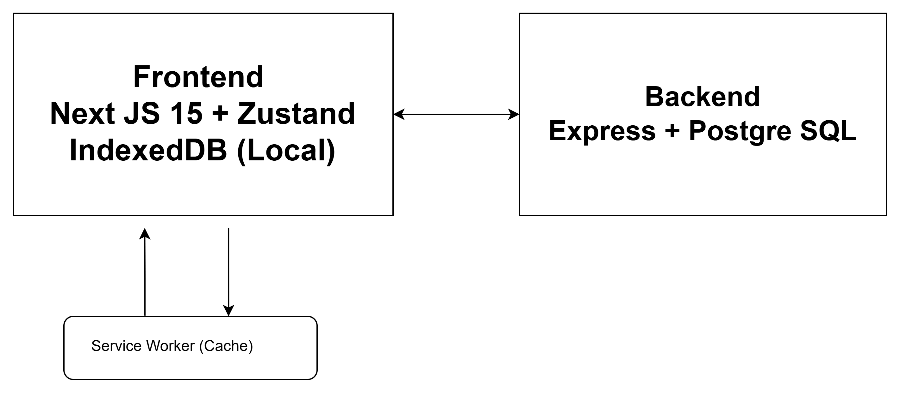
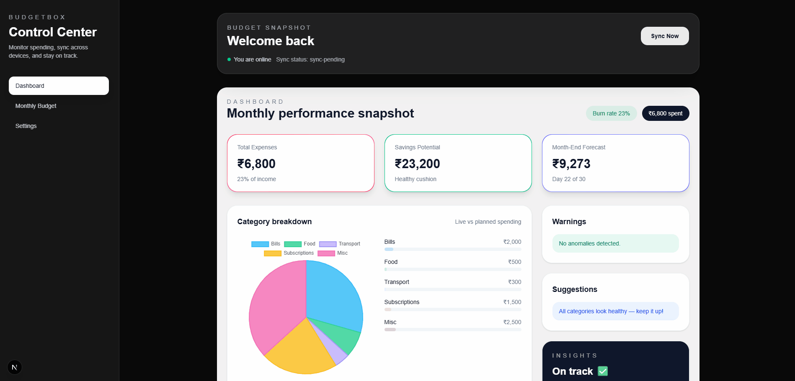
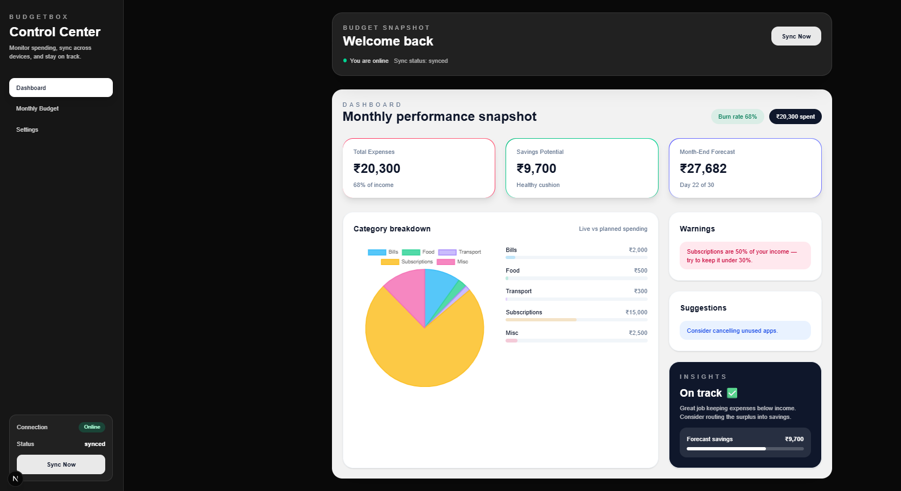
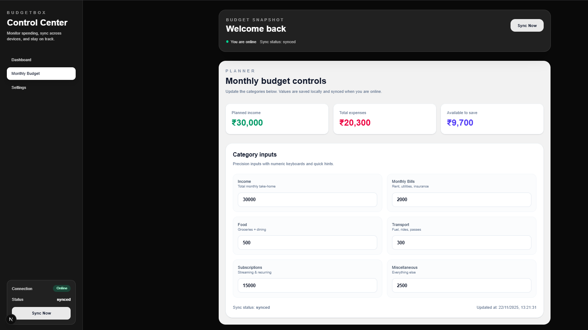

# BudgetBox — Offline-First Personal Budgeting App

## 🚀 Live Demo

Frontend: <YOUR VERCEL URL>  
Backend: <YOUR RAILWAY / RENDER URL>

---

## 👤 Demo Login

Email: hire-me@anshumat.org  
Password: HireMe@2025!

---

## 📦 Tech Stack Used

### Frontend

- Next.js 15 (App Router)
- React 18 + TypeScript
- Tailwind CSS
- Zustand (persist + IndexedDB via LocalForage)
- Chart.js (Recharts)
- Service Worker + Offline Cache
- PWA Support

### Backend

- Node.js + Express + TypeScript
- PostgreSQL
- REST API (Sync + Latest)

---

## ⚙️ Features

### ✔ Fully Offline-First Architecture

- Auto-save on every keystroke
- IndexedDB persistence
- Works even with 0 internet
- Service Worker enabled

### ✔ Sync System

- Local → Server → Local sync
- Conflict resolution (timestamp-based)
- Sync statuses (local-only, sync-pending, synced)

### ✔ Budget Management

- Add/edit monthly budget
- Auto-generated dashboard
- Category-wise pie chart
- Burn rate, savings prediction

### ✔ Anomaly Detection (Rule Engine)

- Food > 40% → Warning
- Subscriptions > 30% → Warning
- Negative savings → Warning

## 🧭 Offline Testing Instructions

1. Open app in browser
2. Go to DevTools → Network → Offline
3. Edit any field → auto-saved
4. Refresh → Data still persists
5. Back Online → Click “Sync Now”
6. Status becomes “synced”

---

### Project Structure

```
BudgetBox/
│
├── Backend/
│   ├── src/
│   │   ├── index.ts
│   │   ├── routes.ts
│   │   └── .env
│   ├── package.json
│   ├── pnpm-lock.yaml
│   ├── tsconfig.json
│
├── frontend/
│   ├── .next/
│   ├── lib/
│   ├── node_modules/
│   ├── public/
│   │   ├── manifest.json
│   │   └── service-worker.js
│   │
│   └── src/
│       └── app/
│           ├── budget/
│           │   └── page.tsx
│           ├── hooks/
│           │   └── useOnlineStatus.ts
│           ├── lib/
│           │   └── store/
│           │       ├── budgetStore.ts
│           │       └── sync.ts
│           │
│           ├── favicon.ico
│           ├── globals.css
│           ├── layout.tsx
│           ├── page.tsx
│           └── sw-register.tsx
│
│   ├── .env
│   ├── .gitignore
│   ├── eslint.config.mjs
│   ├── next-env.d.ts
│   ├── next.config.ts
│   ├── package.json
│   ├── pnpm-lock.yaml
│   ├── postcss.config.mjs
│   └── tsconfig.json
│
├── ARCHITECTURE.md
└── README.md
```

## 🏗 Architecture Diagram



## 🛠 Local Setup

### Frontend

```
cd frontend
pnpm install
pnpm dev
```

### Backend

```
cd backend
pnpm install
pnpm dev
```

### Database Setup (PostgreSQL)

```
CREATE DATABASE budgetbox;

CREATE TABLE budgets (
id SERIAL PRIMARY KEY,
user_email TEXT,
payload JSONB,
updated_at TIMESTAMP DEFAULT NOW()
);
```

# Screenshots / GIF demo

### GIF Demo



### Screenshot Demo



